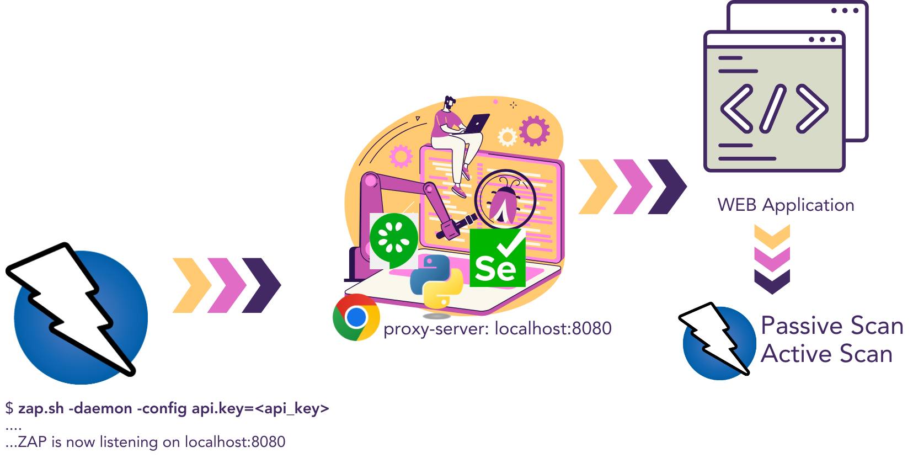

# behave-zap Learning

Learning repository for the `behave-zap` Python library, showing how to combine:
- Behave + Selenium functional automation
- OWASP ZAP DAST execution
- CI-based security feedback with PR annotations



## Learning Goals

This repository helps you learn how to:
- run classic BDD tests with Behave
- enable DAST checks on selected scenarios using `@dast`
- route browser traffic through ZAP proxy
- generate JUnit + ZAP reports
- publish security findings in CI pull requests

## Learning Path

1. Learn OWASP ZAP basics
- Official site: https://www.zaproxy.org/
- Getting started docs: https://www.zaproxy.org/getting-started/
- Download ZAP Desktop: https://www.zaproxy.org/download/

2. Learn `behave-zap`
- GitHub project: https://github.com/testingsoul/behave-zap
- Package (PyPI): https://pypi.org/project/behave-zap/

3. Run this repository locally
- install requirements
- run functional scenarios
- start ZAP
- run `@dast` scenarios and inspect reports

4. Understand CI security feedback
- review workflow: `.github/workflows/ci_dast.yml`
- review PR annotation action: https://github.com/testingsoul/zap-annotations

## Requirements

- Python `3.12`
- `pip`
- Docker (required for local ZAP daemon execution in this project)
- Chrome/Chromium runtime compatible with Selenium

## Installation

1. Clone repository
```bash
git clone <your-fork-or-this-repo-url>
cd CI_testDAST_behave
```

2. Create virtual environment and install dependencies
```bash
cd test
python3 -m venv venv
source venv/bin/activate
pip install -r requirements.txt
```

3. Validate Behave is available
```bash
behave --version
```

## Project Structure

- `test/features/`: Gherkin features
- `test/steps/`: step definitions
- `test/pages/`: page objects
- `test/environment.py`: Behave hooks delegated to `behave-zap` runner
- `test/conf/properties.cfg`: runtime + DAST configuration
- `.github/workflows/ci_dast.yml`: CI pipeline for DAST + reports + annotations

## behave-zap In This Repository

`behave-zap` centralizes the integration between Behave, Selenium driver management, and ZAP lifecycle/reporting hooks.

Current integration (`test/environment.py`):
- creates a shared runner using `create_default_runner(...)`
- reads configuration from `conf/properties.cfg`
- delegates all Behave lifecycle hooks (`before_all`, `before_feature`, `before_scenario`, `after_scenario`, `after_feature`, `after_all`) to the runner

Why this matters for learning:
- test glue code stays very small
- DAST behavior is controlled from configuration, not hardcoded in steps
- you can focus on feature and step design while reusing a standard security testing pipeline

## Local Execution

1. Run functional tests (without DAST tag filtering)
```bash
cd test
source venv/bin/activate
behave
```

2. Start ZAP daemon (Docker)
```bash
docker run -u zap -p 8080:8080 -d zaproxy/zap-stable \
  zap.sh -daemon -host 0.0.0.0 -port 8080 \
  -config api.addrs.addr.name=.* \
  -config api.addrs.addr.regex=true \
  -config api.key=change-me-9203935709
```

3. Run DAST-tagged scenarios
```bash
cd test
source venv/bin/activate
behave -t @dast --junit --junit-directory output
```

Artifacts generated:
- JUnit XML: `test/output/TESTS-*.xml`
- ZAP HTML/XML reports: `test/output/zapreport-*.html`, `test/output/zapreport-*.xml`

## DAST Configuration Reference (`test/conf/properties.cfg`)

### `[Driver]`
- `window_width`, `window_height`: browser window size for reproducible execution.
- `implicitly_wait`: Selenium implicit wait (seconds).
- `explicitly_wait`: explicit wait timeout used by the framework (seconds).
- `headless`: run browser headless (`true`/`false`).

### `[Capabilities]`
- Reserved section for Selenium capabilities if needed.

### `[ChromeArguments]`
Chrome startup arguments passed to the driver. In this project they include security/proxy-compatible flags such as:
- `ignore-certificate-errors`
- `allow-insecure-localhost`
- `allow-running-insecure-content`
- `disable-web-security`
- `proxy-bypass-list: <-loopback>`

### `[Test]`
- `url`: base application URL under test.
- `username`, `password`: credentials used by login scenarios.

### `[DAST]`
- `api_key`: ZAP API key. Must match the key used when starting ZAP daemon.
- `proxy-server`: ZAP host/port used by browser proxy config.
- `pscan`: enable/disable passive scan (`true`/`false`).
- `ascan`: enable/disable active scan (`true`/`false`).
- `targets_<feature_name>`: per-feature active-scan target list (comma-separated URLs).
- `exclude_targets`: regex patterns excluded from scanning.
- `session_timeout_seconds`: session timeout used by DAST flow.

Important mapping rule:
- `targets_login` maps to `test/features/login.feature`
- `targets_product` maps to `test/features/product.feature`
- `targets_customer_feedback` maps to `test/features/customer_feedback.feature`

## CI Pipeline Details

Workflow file: `.github/workflows/ci_dast.yml`

Main job (`build-and-test`) does:
- checkout code
- setup Python 3.12
- install `test/requirements.txt`
- start OWASP ZAP in Docker daemon mode
- wait for ZAP readiness
- execute `behave -t @dast --junit --junit-directory output`
- upload acceptance test artifacts (`TESTS-*.xml`)
- upload ZAP HTML reports
- on Pull Requests: run `testingsoul/zap-annotations@v1`

PR annotations project:
- https://github.com/testingsoul/zap-annotations

Required secret for annotations:
- `ACTION_TOKEN` (used as `GITHUB_TOKEN` env for annotation publishing)

Second job (`publish-acceptance-test-results`):
- downloads acceptance test artifacts
- publishes unit test style report using `EnricoMi/publish-unit-test-result-action`

## Additional Documentation

- Detailed testing notes: `docs/test.md`
